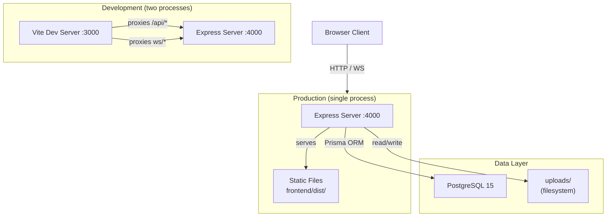
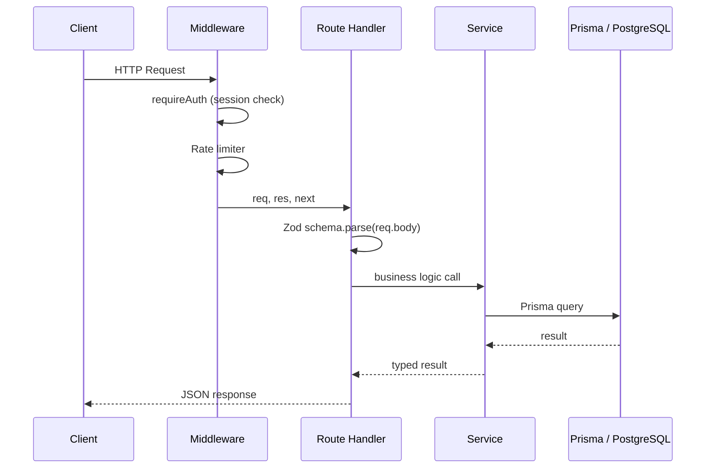
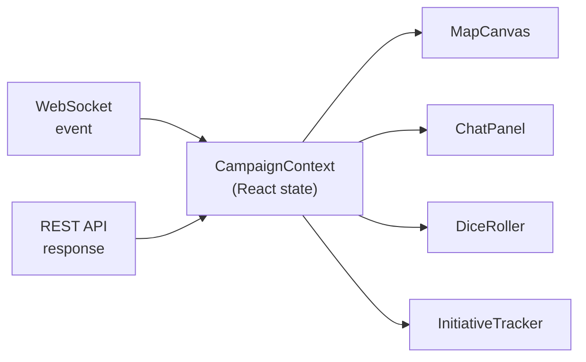
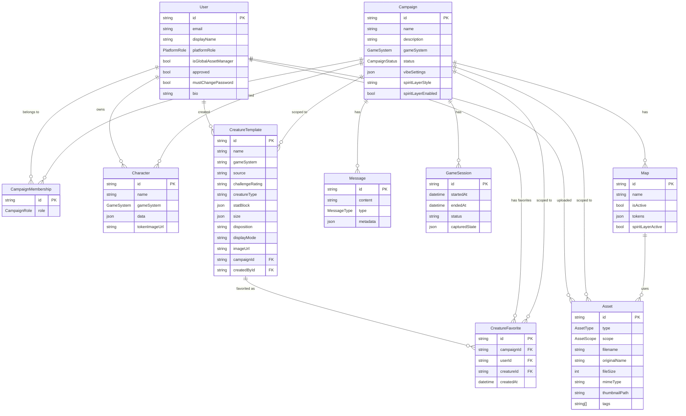
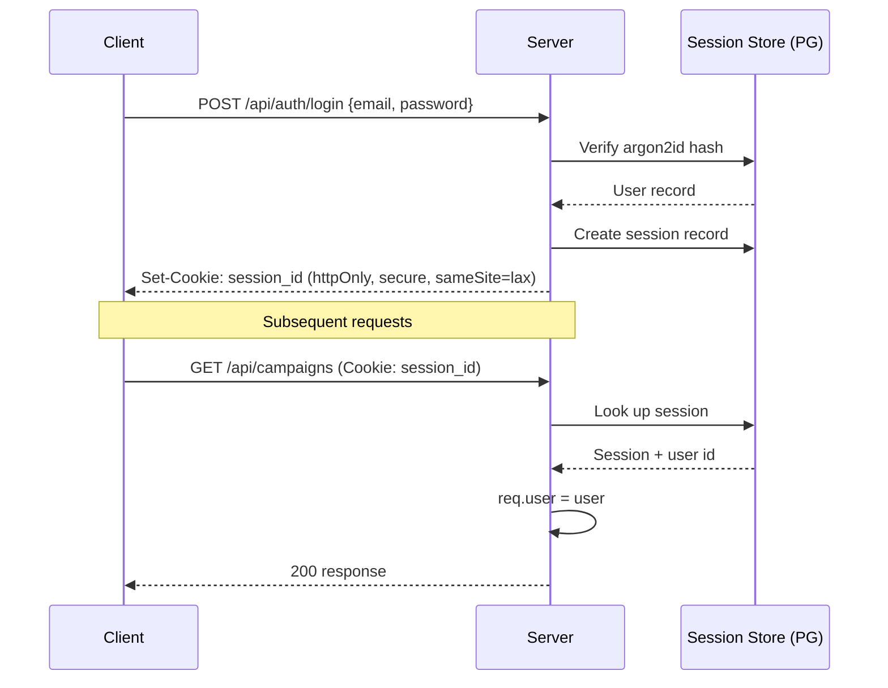
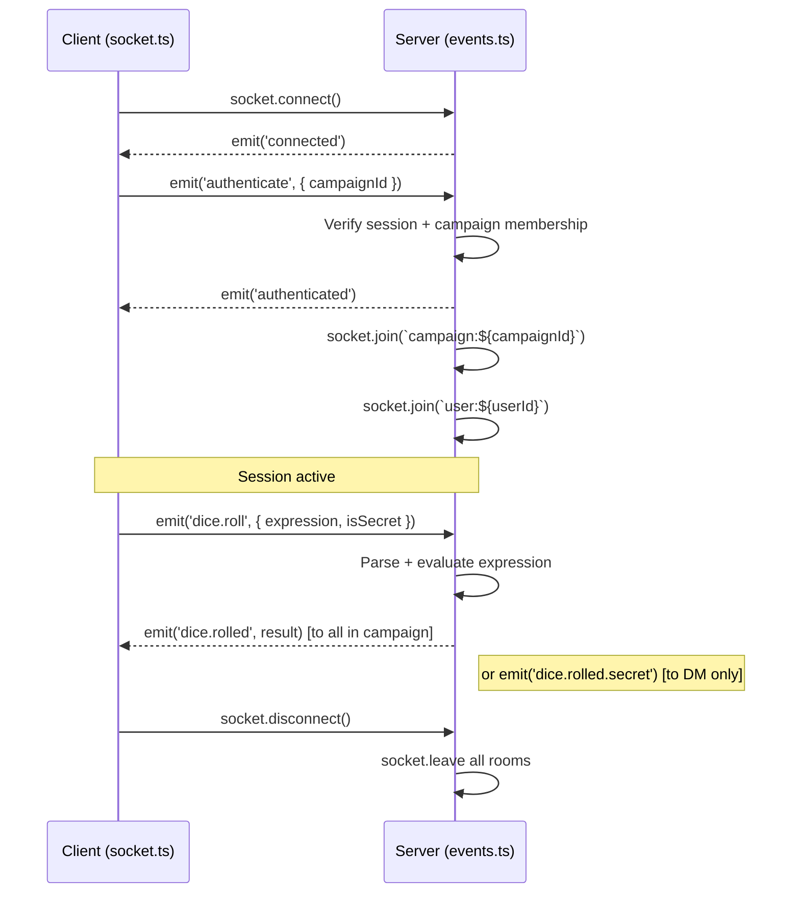

# CozyVTT — Architecture

This document describes the system architecture, data models, and key design decisions in CozyVTT.

---

## Table of Contents

1. [High-Level Overview](#high-level-overview)
2. [Backend Architecture](#backend-architecture)
3. [Frontend Architecture](#frontend-architecture)
4. [Database Schema](#database-schema)
5. [Authentication & Authorization](#authentication--authorization)
6. [WebSocket Architecture](#websocket-architecture)
7. [File Storage](#file-storage)
8. [Game Systems Architecture](#game-systems-architecture)
9. [Key Design Decisions](#key-design-decisions)

---

## High-Level Overview

CozyVTT is a monorepo containing a Node.js/Express API backend and a React SPA frontend. In production, the backend serves both the REST API and the built frontend static files. In development, a Vite dev server runs separately and proxies API/WebSocket traffic to the backend.



---

## Backend Architecture

### Layer Structure

```
src/
├── server.ts          Entry point — creates Express app, attaches Socket.io
├── config/            Configuration loading (env vars, validation)
├── middleware/
│   ├── auth.ts        Passport.js session middleware, requireAuth guards
│   ├── rateLimit.ts   Per-route rate limiters (auth, dice, chat, file upload)
│   └── upload.ts      Multer configuration, magic byte validation
├── routes/            HTTP route handlers
│   ├── auth.ts        Login, logout, register, password reset
│   ├── users.ts       User CRUD (admin only)
│   ├── campaigns.ts   Campaign CRUD + membership
│   ├── characters.ts  Character CRUD + assignment
│   ├── maps.ts        Map and token management
│   ├── creatures.ts   Creature template CRUD, SRD seeding, favorites
│   ├── assets.ts      File upload and retrieval
│   ├── invitations.ts Campaign invitation lifecycle
│   ├── mfa.ts         TOTP setup, verify, disable, backup codes
│   ├── setup.ts       First-run setup wizard
│   └── admin.ts       Admin: stats, settings, users, backups, logs
├── services/          Business logic (called by routes and WebSocket handlers)
├── validators/        Zod validation schemas (one per domain)
├── websocket/
│   ├── events.ts      Socket.io event handler registration
│   ├── utils.ts       broadcastToCampaign, broadcastToUser helpers
│   └── spirit-layer.ts Spirit layer token filtering logic
├── utils/
│   ├── dice-parser.ts  mathjs-based dice expression evaluator
│   ├── asset-urls.ts   Asset URL normalization
│   └── logger.ts       Winston logger configuration
└── types/             Shared TypeScript interfaces
```

### Request Flow



---

## Frontend Architecture

### Layer Structure

```
src/
├── main.tsx           Entry point — BrowserRouter wrapper
├── App.tsx            Route definitions, auth guards, lazy page loading
├── contexts/
│   ├── AuthContext.tsx    User auth state, login/logout/register actions
│   ├── WebSocketContext.tsx  Socket.io connection lifecycle and event subscriptions
│   └── CampaignContext.tsx   Per-campaign state (map, tokens, vibe, session status)
├── pages/             One file per route (thin; delegates to components and contexts)
├── components/
│   ├── campaign/      Campaign page panels (ChatPanel, DiceRoller, MapCanvas, etc.)
│   ├── character-sheets/  Game system sheet renderers
│   ├── common/        Reusable primitives (Toast, ConfirmDialog, etc.)
│   └── admin/         Admin panel tabs
├── services/
│   ├── api.ts         Axios-based REST API client (singleton)
│   ├── socket.ts      Socket.io client wrapper (singleton)
│   └── auth.service.ts  Auth-specific API calls
├── hooks/             Custom hooks (useFocusTrap, useWebSocketEvent, etc.)
├── types/             TypeScript type definitions mirroring backend types
├── utils/             Client-side helpers (validation, formatting)
└── styles/            Global CSS, Tailwind directives, effect stylesheets
```

### State Management

CozyVTT uses **React Context** rather than an external state management library:

| Context | Scope | Holds |
|---------|-------|-------|
| `AuthContext` | App-wide | Current user, auth status, login/logout functions |
| `WebSocketContext` | App-wide | Socket connection, event subscription helpers |
| `CampaignContext` | Campaign page | Map data, tokens, vibe state, session status, roster |

The `CampaignContext` is the most complex — it is the single source of truth for all campaign data during a session and is updated both via REST API responses (initial load) and real-time WebSocket events (live updates).

### Data Flow (Campaign Page)



---

## Database Schema

The full Prisma schema is at `backend/prisma/schema.prisma`. Below is a high-level entity relationship diagram.



### Key Schema Notes

- **Token data is stored as JSON inside `Map.tokens`** — tokens are not a separate table. This simplifies real-time updates (the whole token list is atomically replaced on moves).
- **Character sheet data is stored as JSON in `Character.data`** — the schema is validated at the API layer by game-system-specific Zod schemas but stored untyped in Postgres. This allows flexible incremental saves.
- **`vibeSettings` and `capturedState` are JSON columns** — used to persist complex nested state that changes frequently.
- **`CreatureTemplate` uses two scopes** — SRD creatures have `campaignId = null` (global, read-only) while custom creatures have a campaign FK. The `source` field distinguishes them (`'srd'` vs `'custom'`).
- **`CreatureFavorite` is a per-campaign, per-user join table** — with a unique constraint on `(campaignId, userId, creatureId)` to prevent duplicate favorites. Cascade deletes ensure cleanup when creatures, users, or campaigns are removed.

---

## Authentication & Authorization

### Session Authentication

CozyVTT uses **express-session** with **connect-pg-simple** to store sessions in PostgreSQL. This means sessions survive server restarts and scale to multiple processes.



### Role-Based Authorization

Authorization is enforced at two levels:

1. **Platform level** — `requirePlatformRole(PlatformRole.ADMIN)` middleware on admin routes
2. **Campaign level** — inline checks inside route handlers that verify `CampaignMembership.role`

```typescript
// Example: DM-only route guard
const membership = await prisma.campaignMembership.findFirst({
  where: { campaignId, userId: req.user.id }
});
if (!membership || membership.role !== CampaignRole.DM) {
  return res.status(403).json({ error: 'DM access required' });
}
```

### MFA (TOTP)

MFA uses the `speakeasy` library for TOTP generation and verification. The `window: 1` setting allows ±30 seconds of clock drift. Backup codes are SHA-256 hashed before storage and shown to the user only once.

---

## WebSocket Architecture

### Connection Lifecycle



### Room Structure

- `campaign:<id>` — all connected members of a campaign
- `user:<id>` — per-user room for targeted broadcasts (e.g., secret dice results)

### Spirit Layer Security

Token data is filtered **per-client** before being broadcast. The server maintains two views of the token list:

- **DM view** — all tokens, both layers, all metadata including DM notes
- **Player view** — material-layer tokens only, plus tokens that belong to the player's own character if they have spirit crossover

This filtering happens in `src/websocket/spirit-layer.ts` and is applied in the `map.change` handler before sending `map.changed` to each individual client.

### WebSocket Event Reference

See [API_REFERENCE.md](API_REFERENCE.md#websocket-events) for the full event listing.

---

## File Storage

Uploaded files are stored on the local filesystem under `backend/uploads/`:

```
uploads/
  maps/         {id}.{ext}           Original map image
                {id}_thumb.webp      300px thumbnail
  tokens/       {id}.{ext}
                {id}_thumb.webp
  audio/        {id}.{ext}
  avatars/       {userId}_avatar.{ext}
  backups/      cozyvtt_{timestamp}.sql.gz
```

### Upload Pipeline

1. **Multer** receives the multipart upload and streams to a temp file
2. **Magic byte validation** (`file-type` library) — verifies the actual file type matches the declared MIME type
3. **Size limit check** — configurable per asset type via environment variables
4. **Sharp** generates a WebP thumbnail (for maps and tokens)
5. File is moved to its final location; the `Asset` record is created in the database

### Asset Scoping

Assets have three scopes:

| Scope | Who can see/use it | Who can upload |
|-------|--------------------|----------------|
| `GLOBAL` | All users on the platform | Admins and Global Asset Managers |
| `USER` | The uploading user only | Any user |
| `CAMPAIGN` | All campaign members | Campaign DM, players (tokens only) |

---

## Game Systems Architecture

### Adding a Game System

See [GAME_SYSTEMS.md](GAME_SYSTEMS.md) for the step-by-step guide.

### How It Works

Each game system consists of three parts that must be kept in sync:

```
Backend                          Frontend
─────────────────────────────    ────────────────────────────────────
src/game-systems/{system}.ts     src/types/game-systems/{system}.ts
  TypeScript types                 Mirrored TypeScript types

src/validators/game-systems/     src/components/character-sheets/
  {system}.schema.ts               {system}/
  Zod validation schema              {System}CharacterSheet.tsx
                                     {System}SheetWrapper.tsx

src/utils/character-templates/
  {system}.ts
  Default template data
```

Character data round-trips as JSON:

```
User fills sheet → SheetWrapper calls onSave(data)
→ CharacterEditorPage sends PUT /api/characters/:id { data }
→ Backend validates data against Zod schema (partial allowed)
→ Stored as character.data in PostgreSQL
→ On load: GET /api/characters/:id returns character.data
→ CharacterSheet hydrates from character.data
```

---

## Key Design Decisions

### Why express-session instead of JWT?

JWTs are stateless, which makes revocation difficult — a compromised token stays valid until expiry. For a self-hosted platform where admins need to be able to force-logout users, session-based auth with a server-side store is simpler and more secure.

### Why React Context instead of Redux/Zustand?

The app has three isolated state domains (auth, websocket, campaign) that don't need complex cross-cutting updates. Context with `useReducer` or `useState` is sufficient and avoids the added dependency and abstraction overhead. If state complexity grows significantly, Zustand would be a natural next step.

### Why store tokens in `Map.tokens` JSON instead of a separate table?

Token positions change at up to 60fps during movement. Normalizing into a separate table would require frequent individual row updates or complex batch upserts. Storing as JSON on the map row allows atomic updates (`UPDATE maps SET tokens = $1 WHERE id = $2`) with a single query per move event.

### Why no client-side campaignId on WebSocket events?

Early in development, the client passed `campaignId` in every WebSocket event payload. This was removed — the server now derives the campaign from the authenticated socket's room membership. This eliminates a class of campaign-spoofing attacks where a player could send events to a campaign they're not a member of.

### Why HTML Canvas instead of a SVG or DOM-based map renderer?

Canvas provides the best performance for the use case: pan, zoom, token rendering, and real-time movement at 60fps with potentially hundreds of tokens. SVG struggles at scale, and DOM-based approaches add layout overhead that compounds with zoom transforms.
